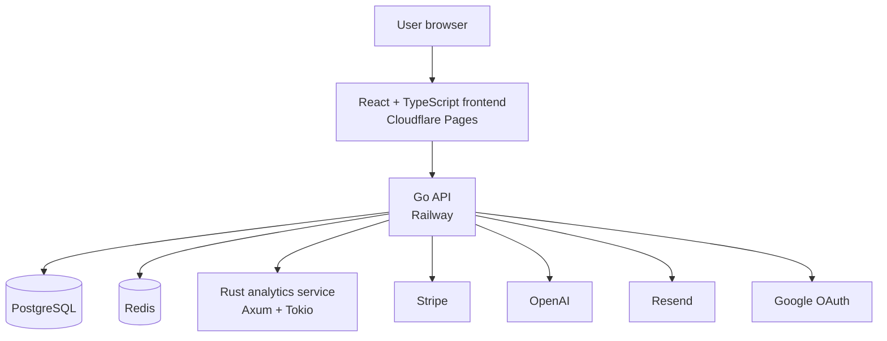

# CandidLyzer

### Understand what your job search is telling you.

CandidLyzer is a production SaaS platform that helps job seekers organize applications, measure performance, identify funnel bottlenecks, and turn job-search data into practical next actions.

[Open CandidLyzer](https://candidlyzer.com) · [View pricing](https://candidlyzer.com/#pricing) · [Read the FAQ](https://candidlyzer.com/faq)

---

> [!NOTE]
> This repository is a public product and engineering showcase.  
> The proprietary CandidLyzer source code and production configuration are maintained privately.

## The problem

A serious job search quickly becomes difficult to understand.

Applications are spread across browser tabs, spreadsheets, emails, notes, and job boards. Candidates can usually count how many applications they have sent, but they often cannot answer more useful questions:

- Which application sources produce the strongest responses?
- Where does the application funnel lose momentum?
- Is targeting, resume fit, or interview performance the primary bottleneck?
- How many responses, interviews, or offers might the next application batch produce?
- What should be improved next?

CandidLyzer turns individual application records into a structured view of the entire search.

## Product overview

CandidLyzer combines application tracking, funnel analytics, forecasting, job-page parsing, and AI-assisted coaching in one product.

Users record applications and update their outcomes over time. CandidLyzer then transforms those records into performance signals that are easier to understand and act on.

The product is designed around a simple workflow:

1. **Track** applications in one structured pipeline.
2. **Understand** response patterns, sources, and bottlenecks.
3. **Act** on a focused recommendation instead of guessing.

## Core product features

### Application tracking

Keep job-search records organized with:

- company and role;
- application status;
- application date;
- source;
- employment type;
- job link;
- notes and additional details.

The tracker supports the full journey from an initial application to a response, interview, rejection, or offer.

### Career dashboard

The dashboard converts application records into a readable overview of the search.

It includes:

- total tracked applications;
- active applications;
- response rate;
- interview and offer activity;
- application funnel;
- source performance;
- recent trends;
- high-level diagnostic signals.

### Funnel diagnostics

CandidLyzer helps users see where momentum is being lost.

Instead of showing only raw totals, the product evaluates the relationship between:

- applications;
- responses;
- interviews;
- offers.

The diagnostic layer highlights the strongest available signal and helps distinguish between possible targeting, resume-fit, source-quality, and interview-stage problems.

### Source comparison

Different application sources can produce very different outcomes.

CandidLyzer compares tracked sources such as direct applications, referrals, job boards, and other channels using the user’s own application history.

The comparison helps answer:

- where applications receive more responses;
- which source produces better interview conversion;
- whether application effort is concentrated in weaker channels;
- where the next application batch may be better spent.

### Forecasting

Forecasts estimate possible outcomes for a future batch of applications using the user’s existing funnel performance.

Depending on the amount and quality of available data, CandidLyzer can estimate:

- expected responses;
- expected interviews;
- expected offers.

Forecasts are directional estimates rather than guarantees. They become more informative as the user records more applications and keeps their statuses current.

### AI coaching reports

CandidLyzer can generate focused coaching reports from dashboard data.

A report may include:

- a summary of the current funnel;
- the primary detected bottleneck;
- supporting evidence;
- a recommended next action;
- a practical plan for the next seven days;
- a success metric for evaluating progress.

Reports are designed to produce a concrete next move rather than generic career advice.

### Job-page parsing

Supported job pages can be converted into cleaner application records.

The parser reduces repetitive data entry by extracting available information such as:

- company;
- role;
- employment type;
- job description details;
- source URL.

Parsing availability depends on the structure and accessibility of the original job page.

### Subscription management

CandidLyzer provides Free and Pro plans through Stripe.

The billing experience includes:

- Stripe-hosted Checkout;
- recurring monthly subscriptions;
- secure webhook processing;
- customer billing management;
- end-of-period cancellation;
- continued Pro access until the paid period ends.

CandidLyzer does not receive or store complete card numbers or CVC data.

## Free and Pro

CandidLyzer keeps the Free plan useful for regular application tracking while reserving deeper and more resource-intensive analysis for Pro.

| Feature | Free | Pro |
|---|---:|---:|
| Application tracking | Unlimited | Unlimited |
| Essential dashboard | Included | Included |
| Job-page parsing | 5 per week | 100 per month |
| AI coaching reports | 1 per month | 20 per month |
| Diagnostics | Limited preview | Full diagnostics |
| Forecasts | Essential signals | Full forecasts |
| Source comparison | Strongest-source preview | Complete comparison |
| Coaching history | Latest report | Complete history |
| Subscription price | $0 | $9/month |

Plan limits and availability may evolve as the product develops.

[Compare plans](https://candidlyzer.com/#pricing)

## Product experience

CandidLyzer uses two connected visual systems:

- a clear, editorial landing experience for discovering the product;
- a focused dark workspace for tracking applications and reading analytics.

The authenticated product is responsive across desktop and mobile devices. On smaller screens, the interface removes unnecessary framing and prioritizes content with bottom navigation.

## System architecture

The public frontend communicates with the Go API. Core user and application data is stored in PostgreSQL, while Redis supports distributed controls such as rate limiting.

Analytics calculations are handled by a dedicated internal Rust service. External providers are integrated through restricted backend flows rather than being called directly with private credentials from the browser.

## Technology stack

### Frontend

- React
- TypeScript
- Vite
- React Router
- Framer Motion
- Lenis
- Vitest
- Playwright

### Backend

- Go
- REST APIs
- secure cookie-based sessions
- JWT refresh-token families
- OAuth 2.0
- PKCE
- signed webhook processing

### Analytics

- Rust
- Axum
- Tokio
- internal authenticated service communication

### Data

- PostgreSQL
- database migrations
- Redis
- structured application and billing data

### Integrations

- Stripe
- OpenAI
- Resend
- Google OAuth

### Infrastructure

- Docker
- Railway
- Cloudflare Pages
- GitHub Actions
- production health monitoring
- readiness checks

## Production engineering

CandidLyzer is operated as a real SaaS product rather than a static portfolio interface.

Its production engineering includes:

- separate frontend, API, analytics, database, and cache services;
- secure authentication and session renewal;
- refresh-token family reuse protection;
- Google OAuth with PKCE;
- PostgreSQL migrations;
- Redis-backed distributed rate limiting;
- bounded JSON request bodies;
- HTTP server timeouts;
- safe public error responses;
- protected internal service communication;
- health and dependency-readiness endpoints;
- responsive desktop and mobile interfaces;
- browser end-to-end testing;
- automated production deployment.

## Billing reliability

Stripe billing is designed around server-side subscription state and verified webhook events.

The integration includes:

- Stripe-hosted Checkout Sessions;
- idempotency protection for checkout attempts;
- reuse and expiration of billing attempts;
- persisted Stripe event IDs;
- duplicate webhook protection;
- event ordering protection;
- subscription lifecycle synchronization;
- customer portal access;
- cancellation at the end of the billing period;
- separation of test and live Stripe resources.

Stripe remains the source of truth for payment processing, while CandidLyzer stores only the billing references and subscription state required to provide product access.

## Security

Security controls include:

- `HttpOnly` authentication cookies;
- secure cookie settings in production;
- refresh-token rotation;
- refresh-token family revocation after detected reuse;
- password hashing;
- expiring password-reset tokens;
- OAuth state and PKCE validation;
- request rate limiting;
- request body size limits;
- restricted CORS configuration;
- authenticated internal analytics requests;
- verified Stripe webhook signatures;
- Stripe event idempotency and ordering protection;
- safe client-facing server errors;
- server-side error logging;
- secret scanning and push protection for public repositories.

Sensitive credentials and environment variables are not stored in this repository.

For responsible vulnerability reporting, see [SECURITY.md](./SECURITY.md).

## Privacy

CandidLyzer stores the account and application information needed to provide the service.

Depending on the feature being used, limited data may be processed by service providers including:

- Google for OAuth authentication;
- Stripe for subscription billing;
- OpenAI for AI-assisted coaching;
- Resend for transactional email delivery;
- infrastructure providers used to operate the application.

Full payment card numbers and CVC values are handled by Stripe and are not stored by CandidLyzer.

See the live policies:

- [Privacy Policy](https://candidlyzer.com/privacy)
- [Terms of Service](https://candidlyzer.com/terms)
- [Payments & Refund Policy](https://candidlyzer.com/payments-refunds)

## Reliability and testing

The project uses several testing layers:

- frontend unit tests;
- backend service and handler tests;
- Rust analytics tests;
- browser end-to-end tests;
- authentication journey tests;
- onboarding and first-application tests;
- password-reset tests;
- billing and subscription lifecycle tests;
- mobile and responsive interface checks;
- production health and readiness monitoring.

Critical user journeys are tested across service boundaries where configuration, cookies, redirects, and webhooks can introduce failures that isolated unit tests may not detect.

## Current status

CandidLyzer is live and accepting users.

Current development priorities include:

- improving diagnostics from real user data;
- strengthening the Free-to-Pro experience;
- expanding supported job-page parsers;
- improving forecast clarity;
- collecting structured product feedback;
- monitoring reliability and conversion;
- refining mobile workflows.

The product is being developed iteratively around real usage rather than treated as a finished one-time portfolio project.

## Product principles

CandidLyzer is built around a few core principles:

- **Clarity before complexity** — analytics should help users decide what to do next.
- **Useful Free access** — the free product should remain genuinely functional.
- **Honest signals** — forecasts and diagnostics should be presented as evidence-based guidance, not guarantees.
- **Security by default** — authentication, billing, and internal services should fail safely.
- **One coherent experience** — design, engineering, and product behavior should feel like parts of the same system.
- **Production readiness** — reliability and maintainability matter alongside feature development.

## Repository purpose

This repository exists to present:

- the CandidLyzer product;
- its user experience;
- its public capabilities;
- its system architecture;
- the engineering decisions behind its operation.

It does **not** contain:

- proprietary application source code;
- production environment variables;
- API keys or access tokens;
- internal infrastructure credentials;
- user data;
- payment information.

## Links

- **Live product:** [candidlyzer.com](https://candidlyzer.com)
- **Pricing:** [candidlyzer.com/pricing](https://candidlyzer.com/#pricing)
- **FAQ:** [candidlyzer.com/faq](https://candidlyzer.com/faq)
- **Developer:** [Hektor Qafarov](https://github.com/qafarov-hc)
- **Contact:** [qafarov.dev@gmail.com](mailto:qafarov.dev@gmail.com)

## Ownership

CandidLyzer is designed and developed by **Hektor Qafarov**.

Copyright © 2026 Hektor Qafarov. All rights reserved.

The CandidLyzer name, branding, interface designs, screenshots, documentation, and other materials in this repository may not be reproduced or used commercially without prior written permission.
